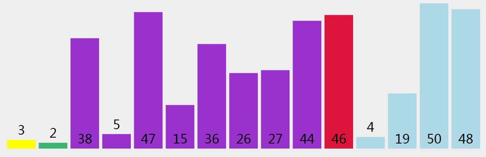

### 排序算法
N个正整数排序  
需要了解的知识点  
- if else  
- for  
- 值 & 引用  
#### 目录
1. 算法  
2. 定义问题  
3. 冒泡排序  
4. 选择排序  
5. 插入排序 
6. 归并排序(merge)  
7. 快速排序  
8. 随机快速排序
#### 什么是算法
高德纳在《计算机程序设计艺术》里对算法的归纳：
1. **输入**：一个算法必须有零个或以上输入量。
2. **输出**：一个算法应有一个或以上输出量。
3. **明确性**：算法的描述必须无歧义，实际运行结果是确定的。
4. **有限性**：必须在有限个步骤内结束
5. **有效性**：又称可行性。能够被执行者实现。
#### 权威书籍推荐
《数据结构与算法分析 -c语言描述》（第七章笔记） 
- 算法分析    
- 表、栈和队列  
- 树  
- 散列  
- 优先队列(堆)  
- 排序  
- ......  
#### 定义问题
```
//数组array 含有N个正整数
//输入量为array
//请将array中的数字从小到大排列
//输出量为排好序的数组
例子：
var array = [5,2,4,6,8]
function sort(){
    //代码
}
sort(array) == [2,4,5,6,8]
```
#### 不会做(没做过遇到直接懵了)
遇到思路障碍怎么办？
1. 将**抽象的问题**转化为**具体的问题**
2. 将**没见过的问题**转化为**见过的问题**

### 普通算法 n²
#### 冒泡排序
[教官双手算法：较高的往后站]  
https://visualgo.net  
两两比较，高的右移。每一次只能排出一个。再循环执行。

```
function sort(array){
    var i,j
    for(i=0;i<array.length;i++){ //第i次
        for(j=0;j<array.length-1-i;j++){  //每一次的起点
            //console.log(array[j]+','+array[j+1])
            if(array[j]<=array[j+1]){

            }else{
                swap(array,j,j+1)
                //console.log('swap'+array[j]+','+array[j+1])
            }
        }
    }
    return array;
}

function swap(array,a,b){
    var temp = array[a]
    array[a] = array[b]
    array[b] = temp
}

console.log(sort([3,5,2,4,1]))
console.log(sort([1,2,1,2,1]))
console.log(sort([1]))
console.log(sort([]))
```
#### 选择排序  
[教官一指算法：最矮的到最前面来]  
  
从左开始选中一个值，和剩下的所有值比较，最小的值做交换。
```
function sort(array){
    var i //第几次
    var j //当前捕捉数值的位置
    var indexOfMin  //记录这次对比中，最小数值的下标(标红)
    for(i=0; i<array.length; i++){
        indexOfMin = i
        for(j=i+1;j<array.length; j++){  //i+1 选一个和第一个做对比 不加1就和自己对比一次
            if(array[j] < array[indexOfMin]){  //如果比最小值小，就记录位置
                indexOfMin = j
            }
        }
        if(indexOfMin !== i){
            swap(array,i,indexOfMin)
        }
    }
    return array;
}

function swap(array,a,b){
    var temp = array[a]
    array[a] = array[b]
    array[b] = temp
}

console.log(sort([3,5,2,4,1]))
console.log(sort([1,2,1,2,1]))
console.log(sort([1]))
console.log(sort([]))
```
#### 插入排序
[起牌算法]  
  
比较，插入范围之间。
### 递归算法  logn
#### 归并排序  
[领导算法]  
  
整体对半分组，分到最小，小组内排序，小组和小组排序，往上排序直至完成。
#### 快速排序  
[自私算法：我前面的都比我矮，我后面的都比我高]  
缺点：如果遇到排好的序列，就和冒泡没区别  
  
向后选择，比自己小的值，提前到自身后面，排序完成把自身移动到比自身小的值后。
#### 随机化快速排序
[我的运气不可能那么差]  
 
随机抽取一个，进行快速排序。

### 需要额外数组赋值排序n+max 
#### 桶排(计数排序)

把上面的数放入下面的容器，在排序。
#### 基数排序

从个位、十位..往上排序。


