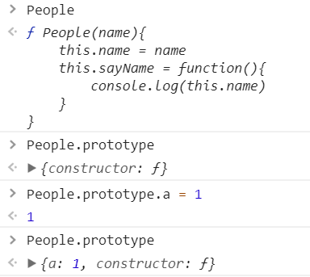
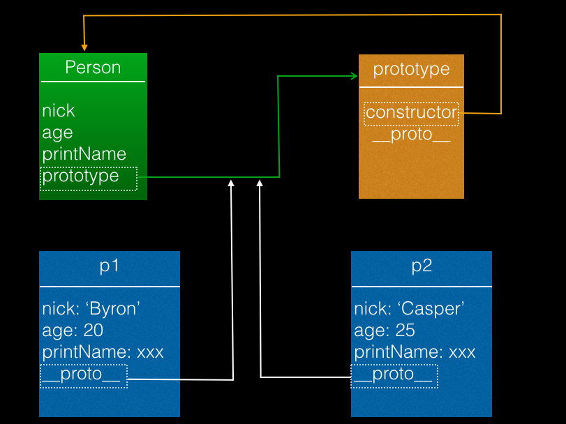

什么是 JS 原型链？  
this 的值到底是什么？  
JS 的 new 到底是干什么的？  
你怎么还没搞懂 this？  

## 对象&原型
### 什么是对象？  
一系列无序 key: value 的集合
```
var obj = { a: 1, b: 2}
var person = {
    a: '1',
    name: '小李子',
    sayName: function(){
        console.log(this.a)
        console.log('My name is 小李子')
    }
}
```
//可以通过*对象.属性*来获取对应属性的值
```
console.log(person.name)  //小李子
person.sayName()   //console.log(1) console.log('My name is 小李子')
```

例子：优化tab切换代码
```
css:  
*{box-sizing: border-box}
ul,li{
    margin:0;
    padding:0;
    list-style: none;
}
.tab-ct .header:after{
    content:'';
    display:block;
    clear:both;
}
.tab-ct .header>li{
    width:60px;
    height:30px;
    line-height:30px;
    border:1px solid #ccc;
    border-right:none;
    float:left;
    text-align:center;
}
.tab-ct .header>li.active{
    background:#ccc;
}
.tab-ct .header>li:last-child{
    border-right:1px solid #ccc;
}
.tab-ct .content>li{
    width: 180px;
    height:100px;
    border:1px solid #ccc;
    border-top:none;
    padding:10px;
    display:none;
}
.tab-ct .content>li.active{
    display:block;
}
HTML:  
<div class="tab-ct">
    <ul class="header">
        <li class="active">tab1</li>
        <li>tab2</li>
        <li>tab3</li>
    </ul>
    <ul class="content">
        <li class="active">
            <ul><li>dddd</li></ul>
        </li>
        <li>ct2</li>
        <li>ct3</li>
    </ul>
</div>
```
  
#### 方案一：
```
缺点：全局变量，会产生命名冲突
/*
var tabs = document.querySelectorAll('.tab-ct .header>li');  //获取所有的菜单li
var panels = document.querySelectorAll('.tab-ct .content>li')  //获取所有的

tabs.forEach(function(tab){
    tab.addEventListener('click',function(){
    
    tabs.forEach(function(node){
        node.classList.remove('active')
    });
    
    this.classList.add('active')
    var index = [].indexOf.call(tabs,this)
    
    panels.forEach(function(node){
        node.classList.remove('active')
    })
    panels[index].classList.add('active')
    })
}) 
```
#### 方案二：（优化上面代码）
```
//优化全局变量，通过对象的方式调用。把tabs和panels变为局部变量。
//缺点：假如功能特别复杂，全都放在init中太啰嗦。
var tab = {
    init:function(){
        //把方案一代码整段放到这里
        var tabs = document.querySelectorAll('.tab-ct .header>li');
        var panels = document.querySelectorAll('.tab-ct .content>li')
        tabs.forEach(function(tab){
            tab.addEventListener('click',function(){
            
            tabs.forEach(function(node){
                node.classList.remove('active')
            });
            
            this.classList.add('active')
            var index = [].indexOf.call(tabs,this)
            
            panels.forEach(function(node){
                node.classList.remove('active')
            })
            panels[index].classList.add('active')
            })
        })
        //结束
    }
}
tab.init()  //对象调用的方法
```
#### 方案三：（优化上面代码）
```
//拆开，分为初始化init，绑定事件bind，渲染render三个部分，名字都是自己起的
//优点：代码更优雅，规避了全局变量，整个页面只有Tab对象
//缺点：页面上有两个Tab组，就会出错
/*var Tab = {
    init:function(){
        // 在这个对象里面，this相当于他自己：this 相当于Tab
        //means:选择页面元素,赋值给Tab,Tab增加两条属性(tabs和panels),原来只有init和bind
        this.tabs = document.querySelectorAll('.tab-ct .header>li');  //添加this
        this.panels = document.querySelectorAll('.tab-ct .content>li');  //添加this
        this.bind()
    },
    bind:function(){
        // 在这个函数中，想找到tabs和panels,也用this
        this.tabs.forEach(function(tab){  //添加this
            tab.addEventListener('click',function(){
            
            Tab.tabs.forEach(function(node){  //添加this没有用了，this是tab了，所以用Tab
                node.classList.remove('active')
            });
            
            this.classList.add('active')
            var index = [].indexOf.call(Tab.tabs,this)  //tabs ==> Tab.tabs
            
            Tab.panels.forEach(function(node){   //添加Tab
                node.classList.remove('active')
            })
            Tab.panels[index].classList.add('active')  //添加Tab
            })
        })
    }
    // render:function(){

    // }
}
Tab.init()*/
```
#### 使用事件代理的方式，去实现tab切换功能
```
var Tab = {
    init:function(){
        this.tabs = document.querySelectorAll('.tab-ct .header>li')
        this.panels = document.querySelectorAll('.tab-ct .content>li')
        this.tabHeader = document.querySelector('.tab-ct .header')

        this.bind()
    },
    bind:function(){
        var self = this
        this.tabHeader.addEventListener('click',function(e){  //可简化为this.tabHeader.onclick = function(){}
            if(e.target.tagName.toLowerCase() ==='li'){  //直接获取tagName,得到的是大写。
                self.tabs.forEach(function(node) {
                    node.classList.remove('active')
                });
                var index = [].indexOf.call(self.tabs,e.target)
                self.panels.forEach(function(node){
                    node.classList.remove('active')
                })
                self.tabs[index].classList.add('active')
                self.panels[index].classList.add('active')
            }
        })
    }
}
Tab.init()
```
解决办法：通过构造函数的方式创建对象。
### 什么是构造函数？  
#### 构造对象：
```
//抛开类，使用字面量来构造一个对象
var obj1 = {
    nick: 'Byron',
    age: 20,
    printName: function(){
        console.log(obj1.nick);
    }
}
var obj2 = {
    nick: 'Casper',
    age: 25,
    printName: function(){
        console.log(obj2.nick);
    }
}
```
问题:
这样构造有两个明显问题  
- 太麻烦了，每次构建一个对象都是复制一遍代码  
- 如果想个性化，只能通过手工赋值，使用者必需了解对象详细  

这两个问题其实也是我们不能抛开类的重要原因，也是类的作用  

#### 使用函数做自动化：
```
function createObj(nick, age){
  var obj = {
      nick: nick,
      age: age,
      printName: function(){
            console.log(this.nick);
        }
  };
  return obj;
}

var obj3 = createObj('Byron', 30);
obj3.printName();
```
问题:
这种方法解决了构造过程复杂，需要了解细节的问题，但是构造出来的对象类型都是Object，没有识别度

#### 使用构造函数：
```
function People(){

}
var p1 = new People('Herbert')  //通过new ..  创建一个对象  
var p2 = new People('valley')  //通过new ..  再创建一个对象

People()  //函数调用  
new People()  //把这个函数当做构造函数，去创建一个对象。

-----------------
补充代码
function People(name){
    this.name = name
    this.sayName = function(){
        console.log(this.name)
    }
    return 1 // 多余，删掉该行。
    //return 简单类型，没有任何效果
    //return 引用类型(对象，函数，数组，正则表达式)，会把return 的东西拿出来。
    //一般不要有return，除非真的需要。
}

People('herbert') //这样是函数调用，但没有任何意义，this是全局的，相当于window

var p1 = new People('Herbert')
//p1 = {}
//p1.name = 'herbert'
//p1.sayName = function(){}
//return p1
//创建新对象;执行函数;对this进行赋值，this就是创建的空对象;再把刚刚创建的新对象return出来;得到这个对象，再赋值给p1。
```
#### new  
new 运算符接受一个函数 F 及其参数：new F(arguments...)。这一过程分为三步：

1. 创建类的实例。这步是把一个空的对象的 proto 属性设置为 F.prototype 。
2. 初始化实例。函数 F 被传入参数并调用，关键字 this 被设定为该实例。
3. 返回实例。
```
//改造上面的自动化例子
function Person(nick, age){
    this.nick = nick;
    this.age = age;
    this.sayName = function(){
            console.log(this.nick);
    }
}
var p1 = new Person('Byron', 25)
```
#### 构造函数的方式创建对象优化tab切换： 
```
//构造函数命名 开头大写，便于区分
function Tab(tabNode){
    this.init = function(tabNode){
        this.tabs = tabNode.querySelectorAll('.tab-ct .header>li')
        this.panels = tabNode.querySelectorAll('.tab-ct .content>li')
        this.tabHeader = tabNode.querySelector('.tab-ct .header')
    }
    this.bind = function(){
        var self = this
        //self  一个对象里面，一个对象的属性是一个函数。这个函数里面的this，就代表了这个对象
        //这里个this，表示当前的Tab
        this.tabHeader.addEventListener('click',function(e){
            //console.log(this)  这里面的this，代表了这个对象的tabHeader
            //所以用self代表刚刚创建的对象。
            if(e.target.tagName.toLowerCase() ==='li'){
                self.tabs.forEach(function(node) {
                    node.classList.remove('active')
                });
                var index = [].indexOf.call(self.tabs,e.target)
                self.panels.forEach(function(node){
                    node.classList.remove('active')
                })
                self.tabs[index].classList.add('active')
                self.panels[index].classList.add('active')
            }
        })
    }
    //绑定两个属性init和bind，但不会调用

    this.init(tabNode)
    this.bind()
}

var tabNode1 = document.querySelectorAll('.tab-ct')[0]  //页面中第一个class
var tabNode2 = document.querySelectorAll('.tab-ct')[1]  //页面中第二个class

new Tab(tabNode1)
new Tab(tabNode2)
``` 
问题  
构造函数在解决了上面所有问题，同时为实例带来了类型，但可以注意到每个实例printName方法实际上作用一样，但是每个实例要重复一遍，大量对象存在的时候是浪费内存
#### 构造函数
1. 任何函数使用new表达式就是构造函数  
2. 每个函数都自动添加一个名称为prototype属性，这是一个对象  
3. 每个对象都有一个内部属性 __proto__(规范中没有指定这个名称，但是浏览器都这么实现的) 指向其类型的prototype属性，类的实例也是对象，其__proto__属性指向“类”的prototype

#### prototype
任何一个函数都有一个属性，叫prototype。prototype对应一个对象，空间。  
  
```
p = new People()
p上面就会多了一个__proto__属性
__proto__指向了上面的prototype(通过构造函数创建p,p上就多了__proto__属性)
使用People创建了很多对象，每个对象都有一个__proto__属性，这些属性指向的是同一个
所有对象共用一个__proto__
```
  
实例可以通过__prop__访问到其类型的prototype属性，这就意味着类的prototype对象可以作为一个公共容器，供所有实例访问。  
### 原型  
#### instanceof  
instanceof是一个操作符，可以判断对象是否为某个类型的实例  
```
    var p1 = People('herbert') //本质上p1是由People构建出来的
    p1 instanceof People; // true
    //想知道这个对象是由谁创造的

    p1 instanceof Object;// true
    //任何对象都是object的实例(任何对象都是object)

    a = {}
    a instanceof object //true
    //平时写的对象，就是函数构造出来的
```
instanceof判断的是对象
```
    1 instanceof Number; // false
```
#### 抽象重复
- 所有实例都会通过原型链引用到类型的prototype
- prototype相当于特定类型所有实例都可以访问到的一个公共容器
- 重复的东西移动到公共容器里放一份就可以了
```
function Person(nick, age){
    this.nick = nick;
    this.age = age;
}
Person.prototype.sayName = function(){
    console.log(this.nick);
    //this代表p1
}

var p1 = new Person();
p1.sayName();
```
 

#### 原型链的方式创建对象  
```    
function Tab(tabNode){
    this.init(tabNode)
    this.bind()
}

Tab.prototype.init = function(tabNode){
    this.tabs = tabNode.querySelectorAll('.tab-ct .header>li')
    this.panels = tabNode.querySelectorAll('.tab-ct .content>li')
    this.tabHeader = tabNode.querySelector('.tab-ct .header')
}

Tab.prototype.bind = function(){
    var self = this
    this.tabHeader.addEventListener('click',function(e){
        // console.log(this)
        if(e.target.tagName.toLowerCase() ==='li'){
            self.tabs.forEach(function(node) {
                node.classList.remove('active')
            });
            var index = [].indexOf.call(self.tabs,e.target)
            self.panels.forEach(function(node){
                node.classList.remove('active')
            })
            self.tabs[index].classList.add('active')
            self.panels[index].classList.add('active')
        }
    })
}

var tabNode1 = document.querySelectorAll('.tab-ct')[0]  //页面中第一个class
var tabNode2 = document.querySelectorAll('.tab-ct')[1]  //页面中第二个class

var tab1 = new Tab(tabNode1)
var tab2 = new Tab(tabNode2)
```

