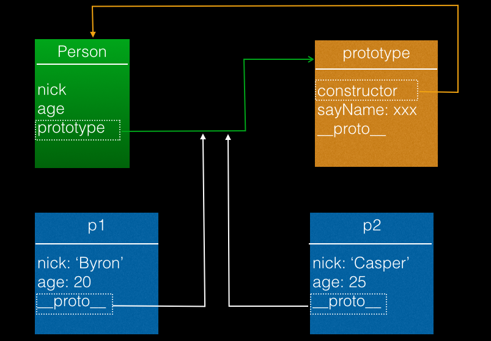
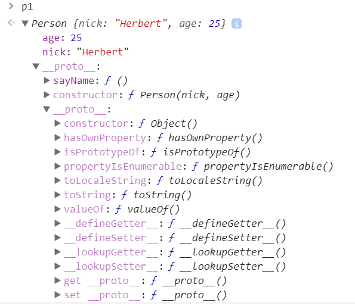
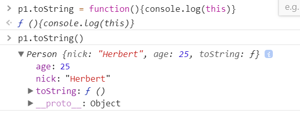
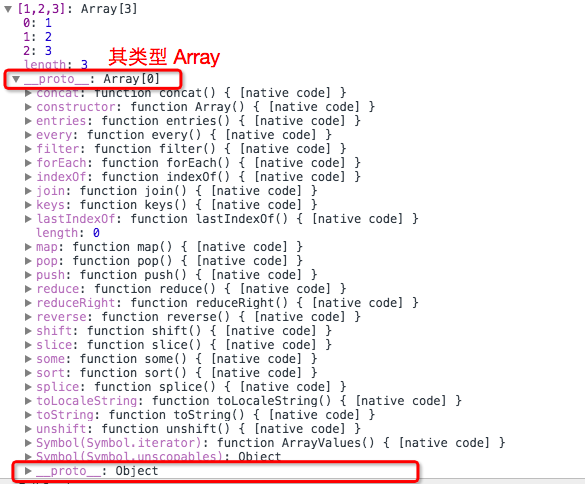
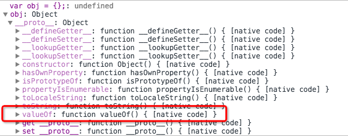
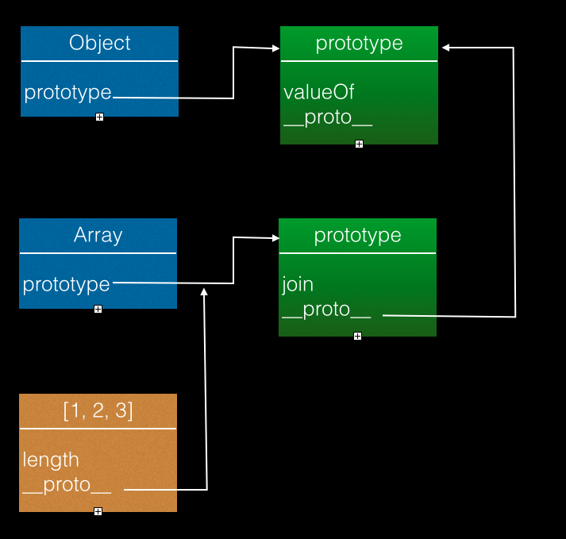
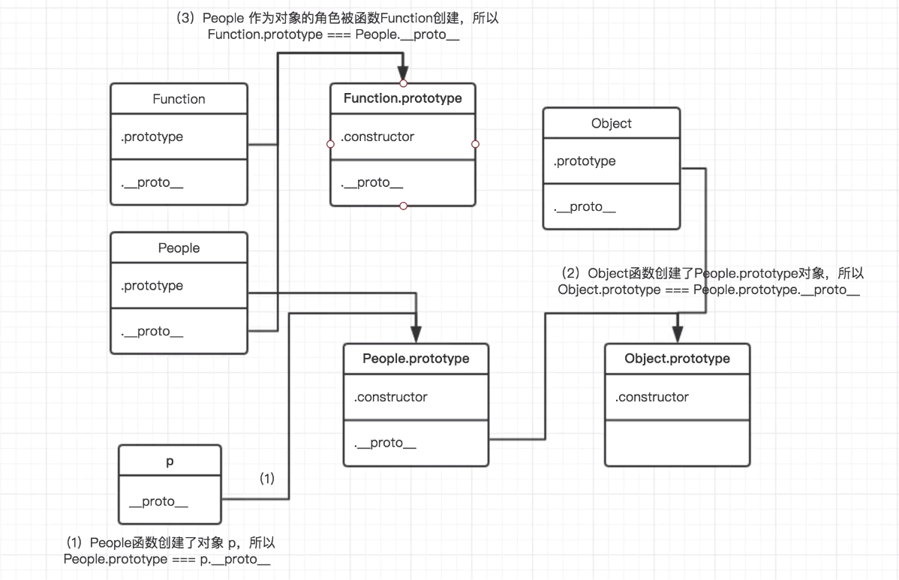

## 原型链
回顾一下类、实例、prototype、__proto__的关系
```
function Person(nick, age){
    this.nick = nick;
    this.age = age;
}
Person.prototype.sayName = function(){   //函数都有一个prototype属性，这个属性是一个对象。sayName是绑定的方法。
    console.log(this.nick);
}

var p1 = new Person('Herbert',25);
var p1 = new Person('Jack',25);

//当new一个函数，做了什么事情？
//第一步：创建一个新的对象
//第二步：执行这个函数，函数里面的this代表刚刚创建的对象，如果对this进行赋值或操作，就是对这个对象进行赋值/操作；
//并且把对象的__proto__都指向函数的prototype
//第三步：把刚刚创建的对象返回。

p1.sayName();
p2.sayName();
```

- 我们通过函数定义了类Person，类（函数）自动获得属性prototype
- 每个类的实例都会有一个内部属性__proto__，指向类的prototype属性
```
p1.__proto__.constructor === Person  //true
Person.prototype.constructor === Person  //true
p1.constructor === Person  //true  发现本身没有，就会从__proto__中查找。
```
```
p1.toString()    //[object Object]  这个属性又是从哪里来的？
//从p1.__proto__.__proto__中找到的  (原型链)
```

```
如果给他赋值，就会覆盖，再调用时就直接获取，不去__proto__中查找
p1.toString = function(){congsole.log(this)}
```

#### 有趣的现象
我们定义一个数组，调用其valueOf方法
```
var a = [1,2,3]  //字面量创建数组
new Array(1,2,3)  //一样的效果  Array是一个构造函数，1,2,3是传的参数
a.join('--')   //"1--2--3"  哪来的？就是Array.prototype里面的

[1, 2, 3].valueOf(); // [1, 2, 3]
```
很奇怪的是我们在数组的类型Array中并不能找到**valueOf**的定义，根据之前的理论那么极有可能定义在了Array的**prototype**中用于实例共享方法，查看一下
  
我们发现**Array**的**prototype**里面并未包含**valueOf**等定义，那么valueOf是哪里来的呢？

一个有趣的现象是我们在**Object**实例的**__proto__**属性（也就是Object的prototype属性）中找到了找到了这个方法
  
那么Array的实例为什么同样可以查找到Object的prototype里面定义的方法呢？

#### 查找valueOf过程
因为任何类的prototype属性本质上都是个类Object的实例，所以prototype也和其它实例一样也有个__proto__内部属性，指向其类型Object的prototype

我们大概可以知道为什么了，自己的类的prototype找不到的话，还会找prototype的类型的prototype属性，这样层层向上查找

大概过程是这样的

- 记当前对象为obj，查找obj属性、方法，找到后返回

- 没有找到，通过obj的__proto__属性，找到其类型Array的prototype属性（记为prop）继续查找，找到后返回

- 没有找到，把prop记为obj做递归重复步骤一，通过类似方法找到prop的类型Object的 prototype进行查找，找到返回


这就是传说中的原型链，层层向上查找，最后还没有就返回undefined

#### 类型
instanceof操作符，判断一个对象是不是某个类型的实例
```
[1, 2, 3] instanceof Array; //true
//判断[1, 2, 3].__proto__是否等于Array.prototype
//如果不是。再看[1, 2, 3].__proto__.__proto__是否等于Array.prototype
//一直往下找，直到找到，或者__proto__为null
```
可以看到[1, 2, 3]是类型Array的实例
```
[1, 2, 3] instanceof Object; //true
```
这个结果有些匪夷所思，怎么又是Array的实例，又是Object的实例，这不是乱套了
其实这个现象在日常生活中很常见其实，比如我们有两种类型
- 类人猿
- 动物
我们发现黑猩猩既是类人猿这个类的物种（实例），也是动物的实例
是不是悟出其中的门道了，类人猿是动物的一种，也就是说我们的两个类型之间有一种父子关系
这就是传说中的继承，JavaScript正是通过原型链实现继承机制的

## 继承
**继承是指一个对象直接使用另一对象的属性和方法。**  
JavaScript并不提供原生的继承机制，我们自己实现的方式很多，介绍一种最为通用的
通过上面定义我们可以看出我们如果实现了两点的话就可以说我们实现了继承
- 得到一个类的属性
- 得到一个类的方法  

分开讨论一下，先定义两个类  
```
function Person(name, age){
    this.name = name;
    this.age = age;
}

Person.prototype.printName = function(){
    console.log(this.name);
};


function Male(sex){
    this.sex = sex;
}

Male.prototype.printAge = function(){
    console.log(this.age);
};
```
```
假设需要定义一个角色，如果把基本属性都写一遍很繁琐。如果以后基本属性改变，这个角色也需要更改。
使用继承的原因：在原来定义好的基础上，增加一点自己的东西。需要借用以前的东西。
例子：
function Person(name,age){
    this.name = name
    this.age = age
}

//可以说话
Person.prototype.sayName = function(){
    console.log('My name is ' + this.name)
}

//可以行走
Person.prototype.walk = function(){
    console.log(this.name + ' is walking')
}

//构造一个人
var p = new Person('jack',20)


function Student(name,age,sex){
    第一步：把属性继承过来
    //Person.call(this,name,age)  //和下面方法一样
    Person.bind(this)(name,age)  //执行Person函数 重点！ 这种方法只能继承属性，不能继承方法。

    第二步：继承方法
    //Student.prototype.__proto__ = Person.prototype  使用下面的方法
    this.sex = sex
}

//继承方法
Student.prototype = Object.create(Person.prototype)
//如果不使用上面这句,可以使用以下代码代替，要注意次序，在下面代码之前。
//fn.prototype = Person.prototype
//function fn(){}
//Student.prototype = new fn()

Student.prototype.constructor = Student  //指向自身，不写则指向Person

//s instanceof Student    true
//s instanceof Person     true
//s.__proto__.__proto__ === Person.prototype   true

//增加的新属性
Student.prototype.doing = function(){
    console.log('I an studing')
}

var s = new Student('mack',2,'boy')
```
#### 属性获取
对象属性的获取是通过构造函数的执行，我们在一个类中执行另外一个类的构造函数，就可以把属性赋值到自己内部，但是我们需要把环境改到自己的作用域内，这就要借助我们讲过的函数call了

改造一些Male
```
function Male(name, sex, age){
    Person.call(this, name, sex);
    this.age = age;
}

Male.prototype.printAge = function(){
    console.log(this.age);
};
实例化看看结果

var m = new Male('Byron', 'male', 26);
console.log(m.sex); // "male"
```
#### 方法获取
我们知道类的方法都定义在了prototype里面，所以只要我们把子类的prototype改为父类的prototype的备份就好了
```
Male.prototype = Object.create(Person.prototype);
//Object.create() 方法会使用指定的原型对象及其属性去创建一个新的对象。
```
[Object.create() - JavaScript | MDN](https://developer.mozilla.org/zh-CN/docs/Web/JavaScript/Reference/Global_Objects/Object/create)  
```
例子：
var a = Object.create({b:1})  //创建一个对象，对象的原型是{b:1}   
a   //输出Object,里面什么都没有，在__proto__下有b:1
```
这里我们通过Object.createclone了一个新的prototype而不是直接把Person.prtotype直接赋值，因为引用关系，这样会导致后续修改子类的prototype也修改了父类的prototype，因为修改的是一个值

另外Object.create是ES5方法，之前版本通过遍历属性也可以实现浅拷贝

这样做需要注意一点就是对子类添加方法，必须在修改其prototype之后，如果在之前会被覆盖掉
```
Male.prototype.printAge = function(){
    console.log(this.age);
};

Male.prototype = Object.create(Person.prototype);
```
这样的话，printAge方法在赋值后就没了，因此得这么写
```
function Male(name, sex, age){
    Person.call(this, name, sex);
    this.age = age;
}

Male.prototype = Object.create(Person.prototype);

Male.prototype.printAge = function(){
    console.log(this.age);
};
```
这样写貌似没问题了，但是有个问题就是我们知道prototype对象有一个属性constructor指向其类型，因为我们复制的父元素的prototype，这时候constructor属性指向是不对的，导致我们判断类型出错
```
Male.prototype.constructor; //Person
```
因此我们需要再重新指定一下constructor属性到自己的类型
#### 最终方案
我们可以通过一个函数实现刚才说的内容
```
function inherit(superType, subType){
    var _prototype  = Object.create(superType.prototype);
    _prototype.constructor = subType;
    subType.prototype = _prototype;
}
```
#### 使用方式
```
function Person(name, sex){
    this.name = name;
    this.sex = sex;
}

Person.prototype.printName = function(){
    console.log(this.name);
};    

function Male(name, sex, age){
    Person.call(this, name, sex);
    this.age = age;
}
inherit(Person, Male);

// 在继承函数之后写自己的方法，否则会被覆盖
Male.prototype.printAge = function(){
    console.log(this.age);
};

var m = new Male('Byron', 'm', 26);
m.printName();
```
这样我们就在JavaScript中实现了继承
#### hasOwnProperty
可能会有一个疑惑，继承之后Male的实例也有了Person的方法，那么怎么判断某个是自己的还是父类的？

hasOwnPerperty是Object.prototype的一个方法，可以判断一个对象是否包含自定义属性而不是原型链上的属性，hasOwnProperty是JavaScript中唯一一个处理属性但是不查找原型链的函数
```
m.hasOwnProperty('name'); // true
m.hasOwnProperty('printName'); // false
Male.prototype.hasOwnProperty('printAge'); // true
```